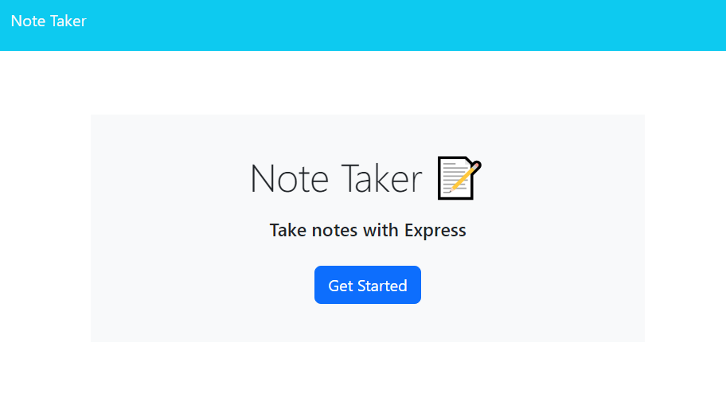
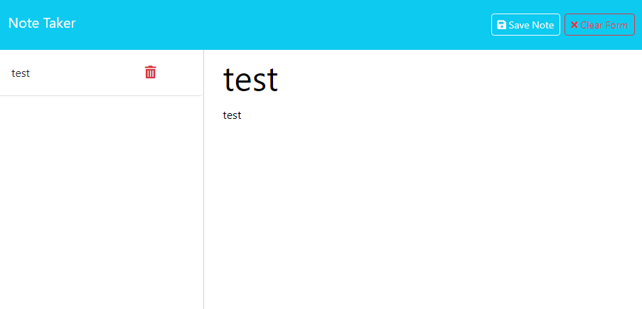

# Simple Note-Taking App


## Overview
This is a simple note-taking application built with Node.js and Express. The app allows users to create, view, and delete notes. Notes are stored persistently in a JSON file, making it easy to manage and retrieve them across sessions.

## Table of Contents
* [URL](#url)
* [Features](#features)
* [Usage](#usage)
* [API Endpoints](#api-endpoints)
* [Technology Stack](#technology-stack)
* [License](#license)
* [Screenshots and Video Walkthrough](#screenshots-and-video-walkthrough)

## URL

https://note-taker-5mah.onrender.com

## Features

* Create Notes: Add new notes with a title and content.
* View Notes: Access a list of existing notes with their titles and content.
* Delete Notes: Remove unwanted notes from the list.

## Usage
```md
Open the app in your browser.

Click on "Get Started" to access the note-taking interface.

Fill in the title and content of your note.

Click the "Save Note" icon to save the note.

Prior notes are saved in the left sidebar.

To delete a note, click the trash icon next to the note in the sidebar.
```
## API Endpoints

* GET /api/notes: Retrieve a list of all notes.
* POST /api/notes: Create a new note.
* DELETE /api/notes/:id: Delete a note by ID.

## Technology Stack

* Node.js: JavaScript runtime for server-side development.
* Express: Web framework for building APIs.
* uuid: Library for generating unique identifiers.
* HTML/CSS: Frontend for the note-taking interface.

## License
The license chosen for this project is the MIT license. For more information about the license, visit https://choosealicense.com/licenses/mit

## Screenshots and Video Walkthrough
https://drive.google.com/file/d/1hnGO8OLadScZFtYPJDl4XWO98DPfdbo9/view


